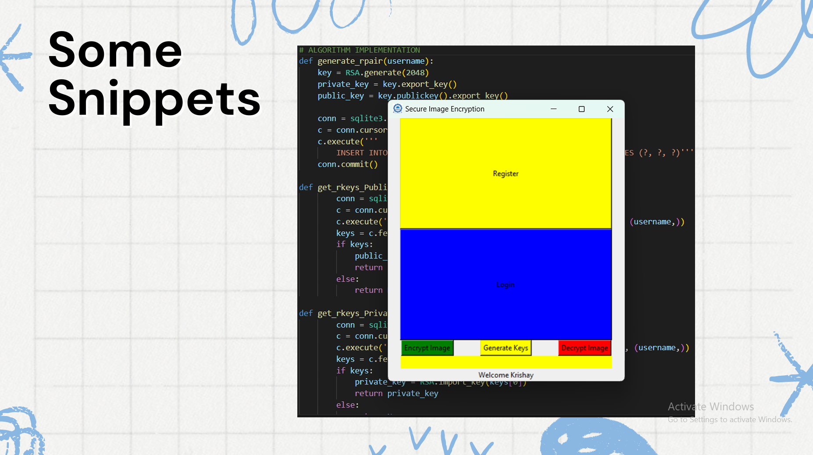
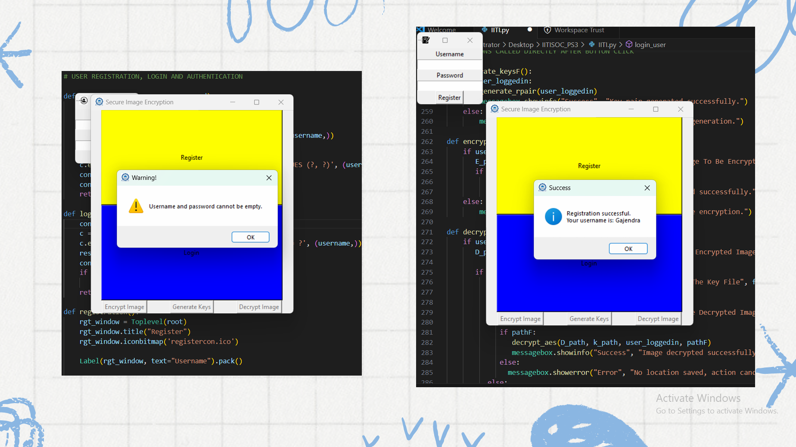

# Secure Image Encryption System

This repository is for IITISOC_2024_PS3 in the cybersecurity domain, which deals with the development and implementation of a secure image encryption system.

### Project ppt -
- [📄 View Project Presentation (PDF)](Project%20Presentation_SOC24.pdf)

## Table of Contents

- #### Objective
- #### Features - 
  - Encryption Algorithms
  - User Authentication
  - Key Management
  - GUI Interface
- #### Snippets
- #### Usage
- #### Team Members 
- #### Some Questions
- #### Support

## Objective

Developing a secure image encryption
 system that utilises advanced cryptographic algorithms such
 as DES (Data Encryption Standard), AES (Advanced Encryption
 Standard), and RSA (Rivest-Shamir-Adleman) to ensure that
 only authorised users can access encrypted images with
 additional functionalities like user authentication and a robust
 key management system.
## Features 

- #### Encryption Algorithms - 
   - Implementing a hybrid system that uses both
     symmetric(DES, AES) and asymmetric(RSA) algorithms to
     encrypt and decrypt images.
   - The DES and AES are used for image encryption and the
     RSA for symmetric keys(for DES and AES)encryption.
- #### User Authentication - 
   - Secure user registration and login using bcrypt for password hashing.
   - ####  Unique username system.
   - User credentials are stored in an SQLite database.
   
- #### Key Management - 
   - DES and AES: Keys are randomly generated and stored securely.
   - RSA: Public and private keys are generated, stored, and used for encryption and decryption.
- #### GUI Interface - 
   - Built with Tkinter for a user-friendly experience.
   - Provides options for selecting images and performing encryption/decryption.

## Snippets - 
   - 
   - 

## Usage

###  Prerequisites -
  - Python 3.x
  - Libraries like - PyCryptodome, SQLite3, tkinter, bcrypt.
### Steps - 
 - Run the application
 - Register yourself 
 - Then, Login
 - Generate Keys (RSA)(Only if you are a new user, otherwise skip this step)
 - Choose the image to be encrypted - after getting the success message, two files will be saved on your system, with the same name (as that of the original image), one for the ciphertext( .enc )and the other for the key file( .key ) (look for them in downloads section of your system)
 - Delete the original image from your system
 - At this stage, the image is well encrypted and can be decrypted, whenever necessary
 - To decrypt it, choose the file to be decrypted (which is the ciphertext ) and the corresponding key file ( You will have to login again, whenever you close the program)
 - Enter the name in SaveAs, as you wish to save it and it will be decrypted and saved on your system. (* A popup message will show up reading " Image decrypted successfully. ")

#### *NOTE - if you didn't get the popup message, then it signifies that decryption was unsuccessful and please recheck that both the files(ciphertext and key) are of the same encrypted image.
 
## Team Members

- #### Team head -
   Name -   Krishay Rathaure   
   GitHub - https://github.com/Quanmat
- #### Other Member -
   Name -   Gajendra Singh Rana   
   GitHub - https://github.com/pratapsingh123om

## Some Questions

#### What can we do to improve this program?

Well, a lot can be done to improve it. Firstly, we can create a central database (using for eg - Django). Additionally, we can create a UI, which allows users to share images among themselves, with algorithm implementation.

#### What is the basic principle of this hybrid system?

This hybrid system merges both DES/AES and RSA algorithms.

- Encryption of data(images) is done using the symmetric key(for
DES and AES). 
- Encryption of the symmetric key is done using the public key(of
the receiver/user), through RSA.

#### Why use a hybrid system?

To ensure both security (using RSA) and fast processing (using DES/AES).

## Support
Contact the team leader for any questions.

